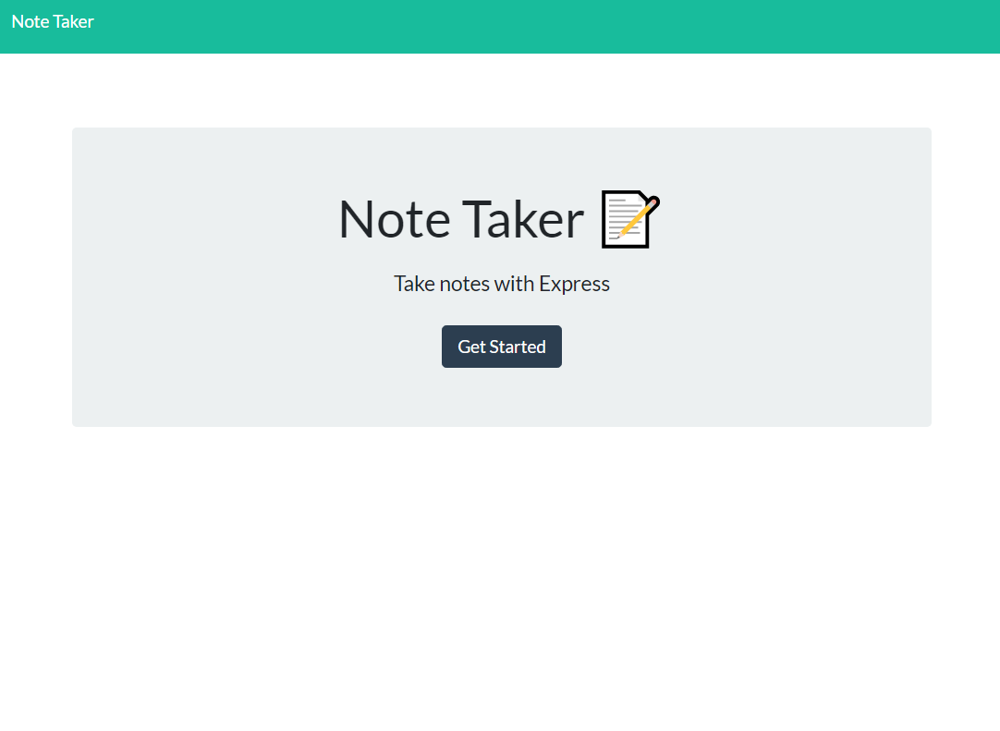
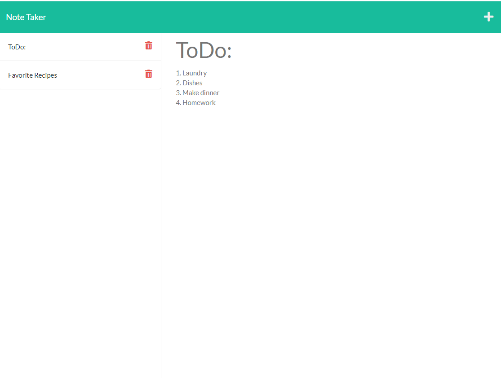

# note-taker

## Description

This application allows the user to create, view, and delete stored text memos.

## Table of Contents

- [Installation Instructions](#Installation-Instructions)
- [Usage Information](#Usage-Information)
- [Links](#links)

## Installation Instructions

run `npm i` to install express from the package.json file.

## Usage Information

First, run `node server.js` in order to turn on the server. Go to the [Live Server](http://localhost:3000) in your browser. Enter in your memo, 'Title' and 'Text'. Click the floppy disk icon in the top right of the application in order to store your memo. View your stored memos in the sidebar to the left. Delete memos with the red trashcan icon. Add new memo with + icon in the top right.

## Links

[Application](https://secret-shore-64376.herokuapp.com/)
